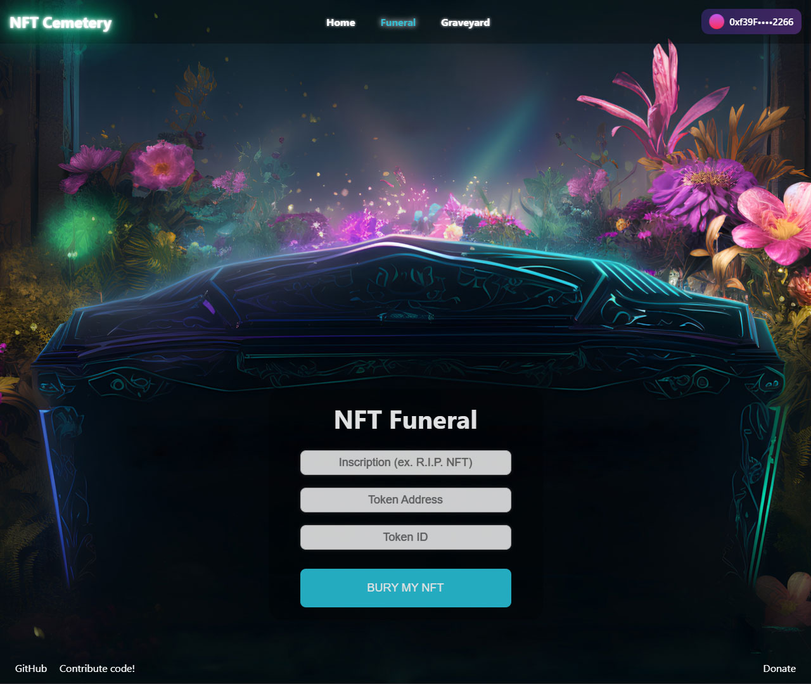
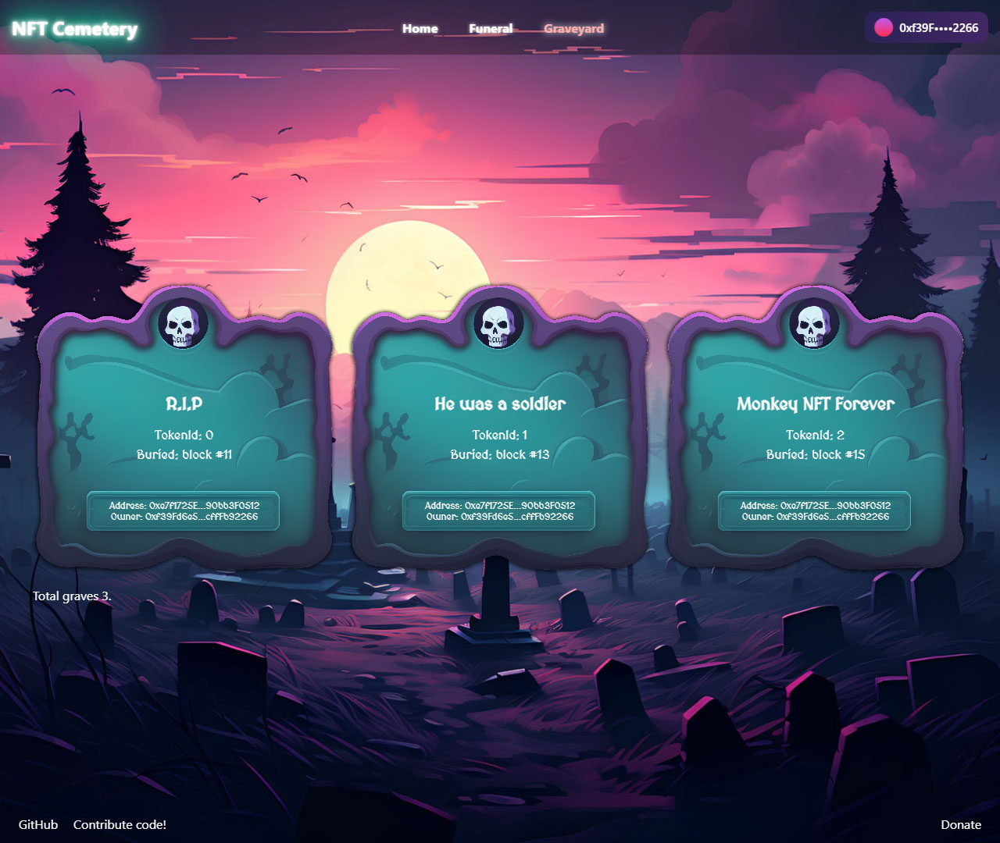

# NFT Cemetery

This is a fun little project to create a cemetery of NFTs. The idea is to create a place where you can bury your NFTs and have them rest in peace.

The repository contains two projects: contract and dApp.

The contract creates a new Grave with the Inscription (limited to 20 characters), BlockNumber of death, token info, and owner info. There is a public getter to retrieve the Graves on the Graveyard.

The ReactJS dApp is a simple interface to interact with the contract. It allows you to connect your wallet, approve the contract to transfer your NFTs, and then bury them. You can also see the list of all the graves and the details of each grave.






## AI Help

To produce designs and mockups, I used MidJourney AI and then upscaled the images with Replica's "Super Resolution" models. ChatGPT 4 was also used to help with some Solidity code.

## WARNING

The NFTs are burned and gone forever. You will never get them back.

### Contribute code

If you want to contribute code, get in touch with me on iosan@protonmail.com.

### Donate

EVM Address 0x386A5a8b33234B5eb22dAeE45C1693c8591cB4a2

BTC Address bc1qszdxp6dzrrzv6h0mnk0093k48h07j4rhvsjl9u

## Testing AI Agent for Documentation Generation

### Introduction

We are testing an AI agent, spinAI, to generate documentation for this repository. This initiative aims to streamline the documentation process and enhance the quality of the documentation provided.

### Setup Instructions

To test the AI agent, ensure you have access to the repository and the necessary permissions to modify documentation files.

### Testing Procedures

1. Identify sections of the documentation that require updates or new content.
2. Use the AI agent to generate the required documentation.
3. Review the generated content for accuracy and completeness.
4. Integrate the content into the existing documentation structure.

### Expected Outcomes

The AI agent should produce coherent and technically accurate documentation that aligns with the existing style and structure of the repository's documentation.

### Example of a Test Case for the AI Agent

```typescript
// Example test case for AI documentation generation
const testDocumentationGeneration = () => {
  const input = "Generate documentation for NFT Cemetery contract";
  const output = spinAI.generateDocumentation(input);
  console.assert(output.includes("NFT Cemetery"), "Documentation should mention NFT Cemetery");
};

testDocumentationGeneration();
```

This section will help contributors and users understand the process and benefits of using AI to assist in documentation generation.